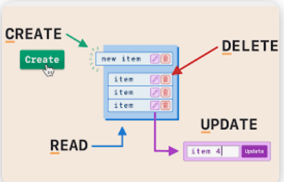
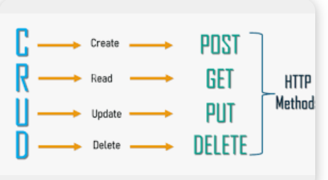
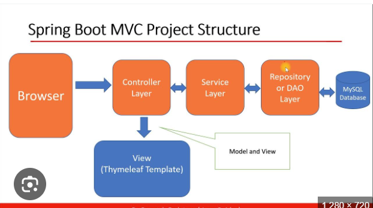

# Basics of Crud Operations :- 

Using Crud Application we can perform below actions 

1) **Create** -> create the resource

    Eg :- creating employees/customers/users.

2) **Read** -> Read the resource

   Eg: Read Employee Info / Customer Info

3) **Update** -> Update the resource
   
   Eg: Update Employee Info / Customer Info

4) **Delete** -> Deleting the resource

   Eg :- Deleting Employee Info / Customer Info

#### Crud operations for Item resource :-

#### CRUD Operations can be mapped to SQL Statements 

#### CRUD Operations are mapped to HTTP Methods

## How can we perform these crud operations ?
To perform these crud operations we need to have below classes.

1) **Model/Entity Class** :-  To save information about the resource. 

   Eg:- Employee Model/Entity can have information about the employee.
   i.e it can store employee name, age, address etc..
   
2) **Repository Class**:-  we are going to save above employee 
information in the database. So we should have repository class to interact with database.
   Eg:- EmployeeRepository / CustomerRepository
   
3) **Controller Class** :- When we make an api call from browser
   then these controller classes are going to accept these requests and returns data.
   These classes are going to have methods for all crud operations.
   Controller class needs data either from database/Api.
   To fetch data it's going to depend on Service classes.
   
4) **Service Class** :- Service classes retains business logic of the application and Acts as middle man between
controllers and Repositories. When controller needs some data then it's going to call service class.
   Now service class fetches data either from Repos i.e from data bases
   or from API's

