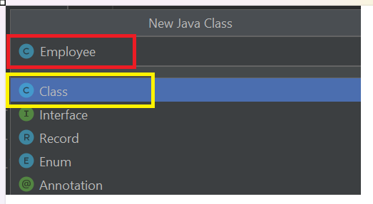
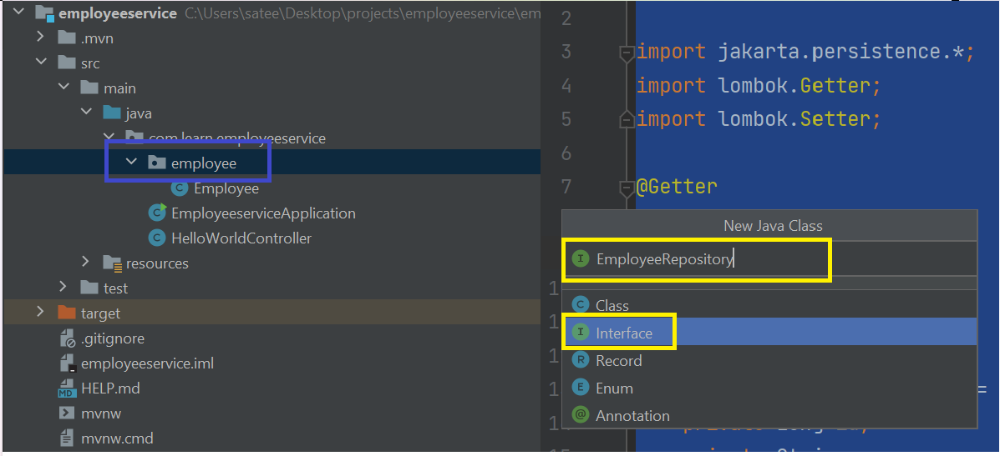
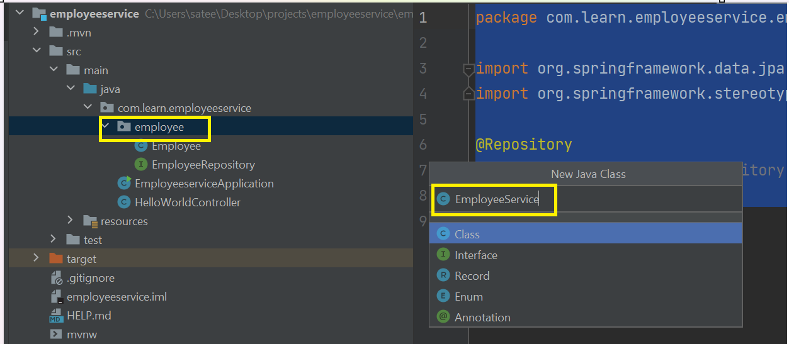

# Introduction :-
In this guide we are going to discuss about

1) Entity creation

2) Repo creation

3) Service Creation

4) Controller Creation

5) Database configuration in application.properties

6) Adding data.sql with sql queries.

7) Reading Employee Data


### Adding employee package :- 
Let us create a package with name employee in src/main/java/com.learn.employeeservice.


## Employee Entity Creation :-

Let us create a new java class i.e Employee file inside employee folder.




### Adding Fields inside Employee :-
Let us add below fields

1) Id (Long/int type)

2) Name (String type)

3) Age (Integer type)

4) isActive (Boolean type)

5) Salary (Double type)

### Employee class with Fields information :-
```
package com.learn.employeeservice.employee;

import jakarta.persistence.*;
import lombok.Getter;
import lombok.Setter;

@Getter
@Setter
@Entity
@Table(name="employee")
public class Employee {
    @Id
    @GeneratedValue(strategy = GenerationType.IDENTITY)
    private Long id;
    private String name;
    private int age;
    private boolean isActive;
    private double salary;
}


```
### Adding Annotations in employee class

@Entity - The class annotated with @Entity informs spring boot this is
entity class and it can be mapped to a db table.

@Table - Using this annotation we can give database table name.

@Id - Marking specific field as primary key of entity. Eg:- id column.

@GeneratedValue - This annotation is used to specify the primary key generation strategy to use. i.e Instructs database to generate a value for this field automatically. If the strategy is not specified by default AUTO will be used.

@Getter - its shortcut annotation for creating all getter methods

@Setter- shortcut annotation for creating all setter methods.

Let us add all these annotations to the Employee Entity class.

## Final Version of Employee Entity

```
package com.learn.employeeservice.employee;

import jakarta.persistence.*;
import lombok.Getter;
import lombok.Setter;

@Entity
@Table(name="employee")
@Getter
@Setter
public class Employee {
    @Id
    @GeneratedValue(strategy = GenerationType.IDENTITY)
    private Long id;
    private String name;
    private int age;
    private boolean isActive;
    private double salary;
}
```
## EmployeeRepository creation :-

We need Repository to interact with database.
So Let us create EmployeeRepository interface in employee package.



**Note** :- EmployeeRepository is an **interface**. so please select
type as interface while creating file.

#### EmployeeRepository is going to extends JpaRepository.

**JpaRepository** ==> JPA(Java Persistence API) Repository is mainly used for managing the data in a Spring Boot Application.
it contains API for basic CRUD operations and also API for pagination and sorting.
```
public interface JpaRepository<T,ID>
Where:

    T: Domain type that repository manages (Generally the Entity/Model class name)
    ID: Type of the id of the entity that repository manages (Generally the wrapper class of your @Id that is created inside the Entity/Model class)

```

## Adding @Repository annotation to the interface :-

@Repository - indicates that an annotated interface is a repository, which is an abstraction of data access and storage.
So we are going to add @Repository annotation on top of interface.


## Final version of EmployeeRepository


```
package com.learn.employeeservice.employee;

import org.springframework.data.jpa.repository.JpaRepository;
import org.springframework.stereotype.Repository;

@Repository
public interface EmployeeRepository extends JpaRepository<Employee, Long> {
}

```

## EmployeeService Creation :-
To implement main business logic of the application we need service
class. So Let us create EmployeeService inside employee package.



### Adding @Service annotation to EmployeeService Class :-

@Service - indicates that an annotated class is a service class.

```
package com.learn.employeeservice.employee;

import org.springframework.stereotype.Service;

@Service
public class EmployeeService {
    
}
```
## EmployeeRepository object fetching through constructor Injection  :-
EmployeeService needs EmployeeRepository object to fetch data from
database.

By using constructor and @Autowired we are setting EmployeeRepository
object here.

## What is @Autowired?
The Spring framework enables automatic dependency injection i.e automatic object creation(We don't need to create repo object here. spring is going to create object for us) 
So if you mark the constructor/method/field with @Autowired spring is going to take care about object creation. 

## Employee Service code with Repo and Service Annotation :-
```
package com.learn.employeeservice.employee;

import org.springframework.beans.factory.annotation.Autowired;
import org.springframework.stereotype.Service;

import java.util.List;

@Service
public class EmployeeService {

    private EmployeeRepository employeeRepository;

    @Autowired
    public EmployeeService(EmployeeRepository employeeRepository) {
        this.employeeRepository = employeeRepository;
    }
}

```

## Adding methods in Employee Service class :-
Let us add findAllEmployees() method
to fetch all employees from db.

Let us add findEmployee() method to fetch single employee
details from db.

## Final version of Employee Service class :-

```
package com.learn.employeeservice.employee;

import org.springframework.beans.factory.annotation.Autowired;
import org.springframework.stereotype.Service;

import java.util.List;

@Service
public class EmployeeService {

    private EmployeeRepository employeeRepository;

    @Autowired
    public EmployeeService(EmployeeRepository employeeRepository) {
        this.employeeRepository = employeeRepository;
    }

    List<Employee> findAllEmployees() {
        return employeeRepository.findAll();
    }

    Employee findEmployee(Long id) {
        return employeeRepository.findById(id).orElse(null);
    }
}

```


